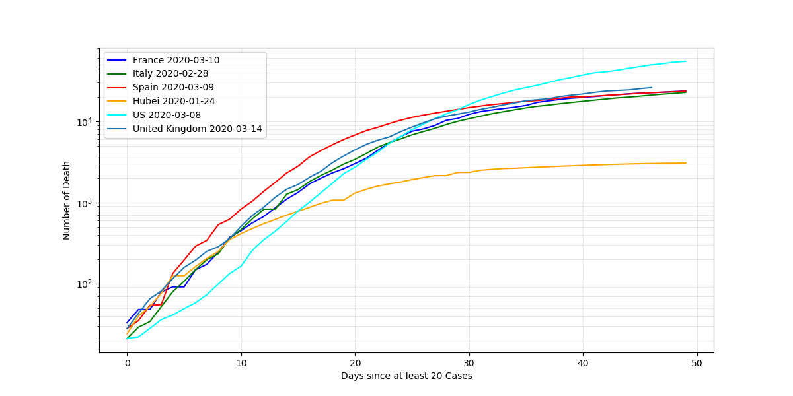
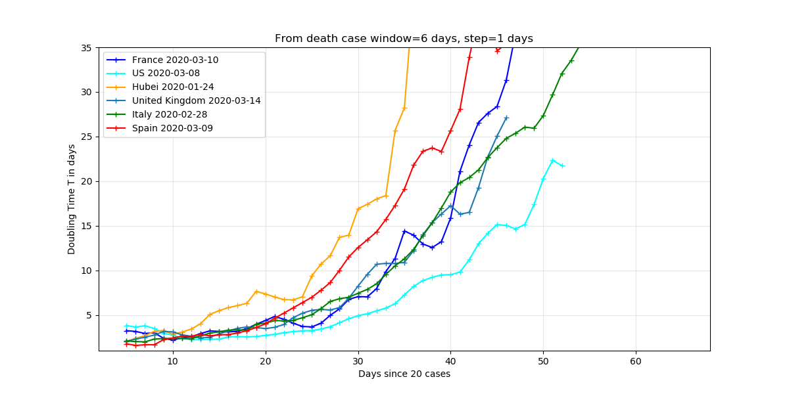
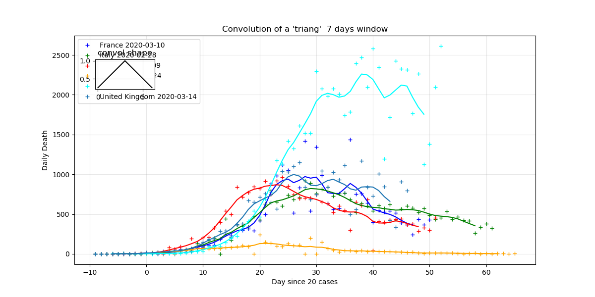
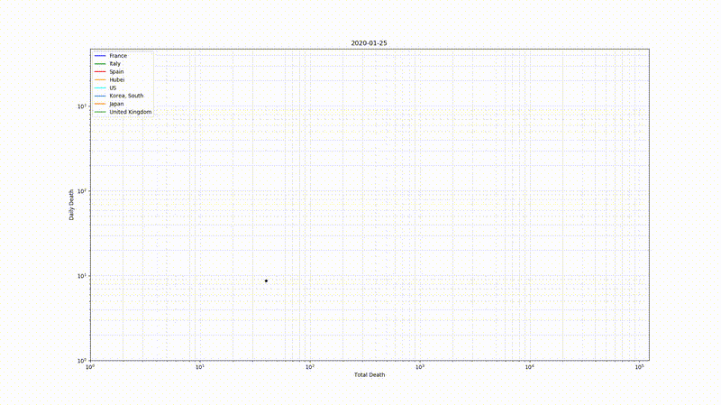
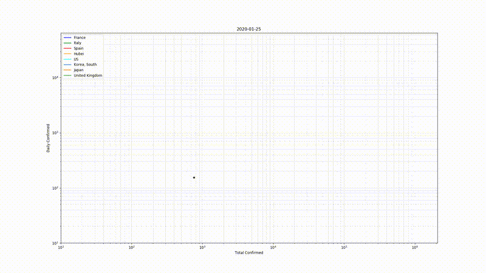
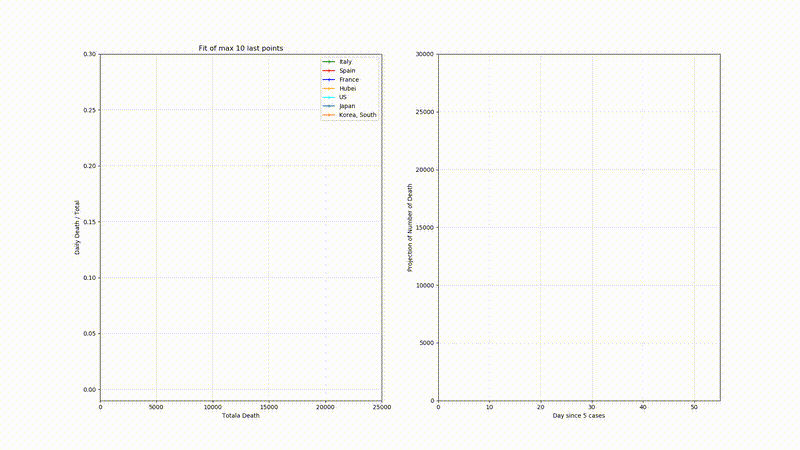

Tools to load and annylise the Corona virus daily report data from the GitHub of Johns Hopkins University Center for Systems Science and Engineering : [https://github.com/CSSEGISandData/COVID-19](https://github.com/CSSEGISandData/COVID-19)

The best way to have an overview is to check the [notebook](./corona.ipynb)

## install 

**2020-03-26 Johns Hopkins series data links has been changed use version 0.1.5, or update `default_urls`**

Using pip

```
>>> pip install coronapy 
```

```
> git clone https://github.com/SylvainGuieu/corona.git
> cd corona 
> python setup.py install
```

Or simply copy `corona.py` in python directory (matplotlib and pandas modules needed)

## Usage 

Best to see the [notebook](./corona.ipynb) for examples. 

## Some Key plots
Some plot created by the coronapy_key_plot.py script in this repository, the animated gif and mp4 (in img/) is done with coronapy_anim.py  

Last Updates : 2020-04-05















