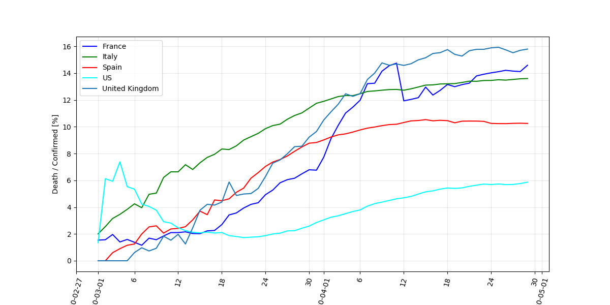

Tool to handle Corona virus daily report data from the GitHub of Johns Hopkins University Center for Systems Science and Engineering : [https://github.com/CSSEGISandData/COVID-19](https://github.com/CSSEGISandData/COVID-19)

## install 

```
> git clone https://github.com/SylvainGuieu/corona.git
> cd corona 
> python setup.py install
```

Or simply copy `corona.py` in python directory (matplotlib and pandas modules needed)


## Load data 

```python
import corona as crn
confirmed, death, recoverd = crn.load_data()
```

## Select data

```python
confirmed_ue = crn.get_subdata(confirmed, countries=["France", "Italy", "Germany", "Spain"], date_min="2020-03-01")
print(confirmed_ue)
```

```
    Province/State Country/Region      Lat     Long  3/2/20  3/3/20  3/4/20  3/5/20  3/6/20  3/7/20  3/8/20  3/9/20  3/10/20  3/11/20  3/12/20  3/13/20  3/14/20  3/15/20
158         France         France  46.2276   2.2137     191     204     285     377     653     949    1126    1209     1784     2281     2281     3661     4469     4499
16             NaN          Italy  43.0000  12.0000    2036    2502    3089    3858    4636    5883    7375    9172    10149    12462    12462    17660    21157    24747
11             NaN        Germany  51.0000   9.0000     159     196     262     482     670     799    1040    1176     1457     1908     2078     3675     4585     5795
18             NaN          Spain  40.0000  -4.0000     120     165     222     259     400     500     673    1073     1695     2277     2277     5232     6391     7798
```

## Plot

```python 
crn.plot_data(confirmed_ue , ylabel="Confirmed")
crn.plt.show()
```


```python
crn.plot_data(confirmed_ue , ylabel="Confirmed", log=True)
crn.plt.show()
```


```python
crn.plot_proportion(death_ue, confirmed_ue, ylabel="Death/Confirmed %")
crn.plt.show()
```


